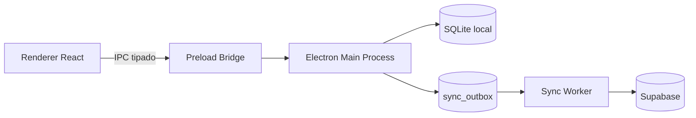

# Rectificadora App

Aplicación de escritorio para la gestión operativa de un taller rectificador, construida con Electron + React y orientada a trabajo offline-first.

Su objetivo principal es permitir que el negocio siga operando incluso sin conexión, con persistencia local robusta y sincronización remota asíncrona cuando la red está disponible.

## Propósito del proyecto

Este sistema centraliza flujos clave del taller:

- Registro y seguimiento de pedidos/órdenes.
- Gestión de servicios y precios.
- Gestión de inventario/repuestos.
- Control de usuarios con roles (master, administrador, caja).
- Operación local estable con cola de sincronización hacia Supabase.

El enfoque del diseño privilegia continuidad operativa local, trazabilidad de cambios y seguridad en la separación de procesos de Electron.

## Características principales

- Arquitectura desktop con Electron.
- Persistencia local en SQLite (fuente de verdad primaria).
- Patrón outbox para sincronización diferida y tolerante a fallos.
- Sincronización remota con reintentos/backoff.
- Bridge seguro de IPC vía preload.
- Autenticación local con hash de contraseñas y gestión de sesiones por rol.
- Soporte de operación LAN (modo standalone/server/client).

## Arquitectura (alto nivel)



### Principios técnicos aplicados

- Local-first: lecturas y escrituras primarias contra SQLite.
- Sync no bloqueante: la red no detiene el flujo operativo del usuario.
- IPC como frontera de seguridad: el renderer no accede directamente a APIs de Node.
- Separación clara de capas:
	- main: lifecycle, servicios nativos, persistencia y sync.
	- preload: API segura para renderer.
	- renderer: UI y experiencia de usuario.

## Stack tecnológico

### Frontend

- React 19
- TypeScript
- Vite 6
- Tailwind CSS 4
- React Router 7

### Desktop y backend local

- Electron 43
- SQLite (`better-sqlite3`)
- IPC tipado y validado en fronteras críticas

### Calidad y tooling

- ESLint 9
- Vitest 4
- electron-builder

## Estructura del repositorio

```text
electron/
	main/       # Persistencia, servicios de sync/licencia, handlers IPC, runtime desktop
	preload/    # Bridge seguro renderer <-> main
	shared/     # Constantes y contratos compartidos (canales, tipos, etc.)

src/
	components/ # Componentes de UI
	context/    # Context providers del frontend
	hooks/      # Hooks de dominio/UI
	layout/     # Estructura principal de pantallas
	pages/      # Pantallas de la aplicación

tests/        # Pruebas unitarias/integración de servicios locales
scripts/      # Automatización de build/versionado/puertos
docs/         # Documentación técnica y SQL de sincronización
```

## Requisitos

- Node.js 20+ (recomendado LTS actual)
- npm 10+
- Windows (objetivo principal de despliegue)

## Instalación

```bash
npm install
```

## Ejecución en desarrollo

### Solo web (Vite)

```bash
npm run dev:web
```

### Desktop completo (Electron + Vite)

```bash
npm run dev:desktop
```

## Scripts disponibles

| Comando | Descripción |
|---|---|
| `npm run dev` | Alias de `dev:web`. |
| `npm run dev:web` | Levanta frontend con Vite en `127.0.0.1:5173`. |
| `npm run dev:desktop` | Levanta entorno desktop de desarrollo (Vite + Electron). |
| `npm run build` | Build web (`tsc -b` + `vite build`). |
| `npm run build:desktop` | Build web + empaquetado Electron. |
| `npm run build:windows` | Flujo de build para Windows usando script dedicado. |
| `npm run lint` | Ejecuta ESLint. |
| `npm run test` | Ejecuta Vitest. |
| `npm run test:coverage` | Ejecuta pruebas con reporte de cobertura. |

## Calidad y verificación recomendada

Antes de cerrar cambios, ejecutar:

```bash
npm run lint
npm run test
npm run build
```

## Configuración de entorno

La app carga variables desde múltiples fuentes en runtime (incluyendo `.env` local y archivos runtime para instalación).

Variables relevantes usadas por la aplicación:

### Operación y LAN

- `APP_DEPLOYMENT_MODE` (`standalone`, `server`, `client`)
- `APP_LAN_HOST`
- `APP_LAN_PORT`
- `APP_LAN_TOKEN`

### Sincronización / Supabase

- `SUPABASE_URL`
- `SUPABASE_SECRET_KEY`
- `SUPABASE_PUBLISHABLE_KEY`

### Licenciamiento

- `LICENSE_TABLE`
- `LICENSE_PUBLIC_KEY`
- `LICENSE_TRIAL_DAYS`
- `LICENSE_ENFORCEMENT`

### Otros

- `ORDER_CODE_PREFIX`
- `VITE_DEV_SERVER_URL` (uso interno de entorno desktop dev)

## Modelo de seguridad

La configuración de Electron está endurecida bajo principios mínimos:

- `contextIsolation: true`
- `nodeIntegration: false`
- `sandbox: true` (cuando aplica)

Además:

- El renderer no debe consumir APIs de Node directamente.
- Las operaciones de datos pasan por handlers IPC en main.
- La validación de payloads en handlers críticos evita entradas inválidas en persistencia.

## Persistencia y sincronización

- Base local SQLite como fuente de verdad.
- Outbox persistente en disco para mutaciones pendientes.
- Procesamiento asíncrono de outbox con reintentos y backoff.
- Estados de sincronización y recuperación ante reconexión.

## Estado de sensores AWM

Este repositorio integra AWM para gobernanza y flujo de trabajo asistido por agentes.

En algunos entornos Windows, la certificación automática de sensores puede quedar en `probe-inconclusive`. Cuando eso ocurre, se usa opt-out deliberado en `.awm/sensors.json` para mantener `preflight` en estado `ready` y usar como gates efectivos `lint`, `test` y `build`.

Comandos útiles:

```bash
awm doctor
awm preflight --json
awm sensors status
```

## Documentación complementaria

- Plan histórico de migración offline-first: `docs/electron-offline-first-plan.md`
- Scripts SQL de sincronización Supabase: `docs/supabase-sync-schema-*.sql`

## Notas para colaboradores

- Mantener cambios incrementales y enfocados.
- Evitar refactors no relacionados con la tarea.
- Preservar tipado estricto y validaciones en fronteras IPC.
- Incluir pruebas para cambios de lógica no triviales.

---

Si quieres, también puedo generar una versión corta de este README orientada a usuarios finales (operación), y dejar esta como documentación técnica para desarrollo.

